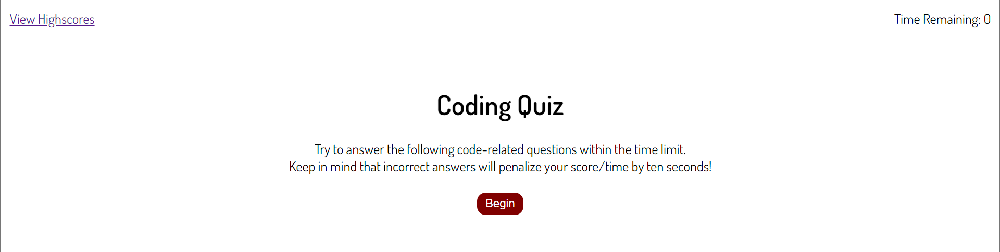
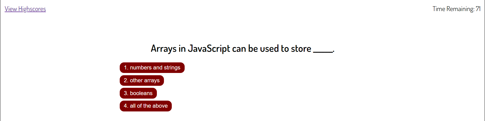
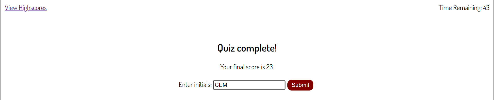
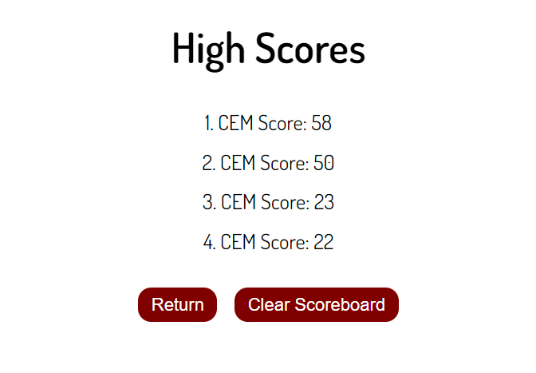

# Assignment: Coding Quiz

Deployable link: https://pocketclint.github.io/CodeQuiz/

## Description

A timed quiz with multiple-choice questions and a score sheet to track results.

## User Story

AS A coding boot camp student
I WANT to take a timed quiz on JavaScript fundamentals that stores high scores
SO THAT I can gauge my progress compared to my peers

## Acceptance Criteria

GIVEN I am taking a code quiz
WHEN I click the start button
THEN a timer starts and I am presented with a question
WHEN I answer a question
THEN I am presented with another question
WHEN I answer a question incorrectly
THEN time is subtracted from the clock
WHEN all questions are answered or the timer reaches 0
THEN the game is over
WHEN the game is over
THEN I can save my initials and score

## Installation

Navigate to the website in preferred browser.

## Usage
When the user clicks Begin button, a timed quiz will start. A question will be displayed with four multiple choice answers. Each correct answer moves on to the next question with no time adjustment, while each incorrect answer subtracts 10 seconds from the timer. The remaining time at the end of the series of questions is the user's score, and can be tracked via input submission at the end of the quiz. A High Scores page retains this information.

## Screenshots

## License
Please refer to the license in the repo.